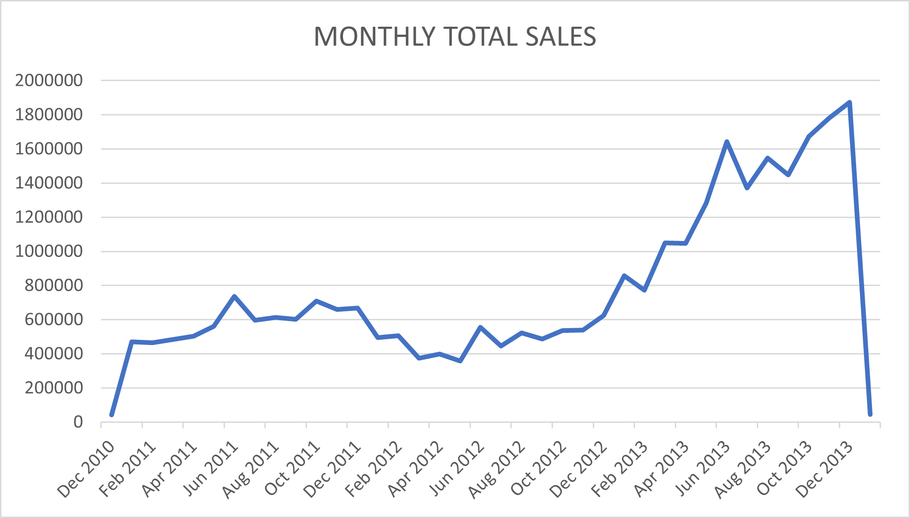
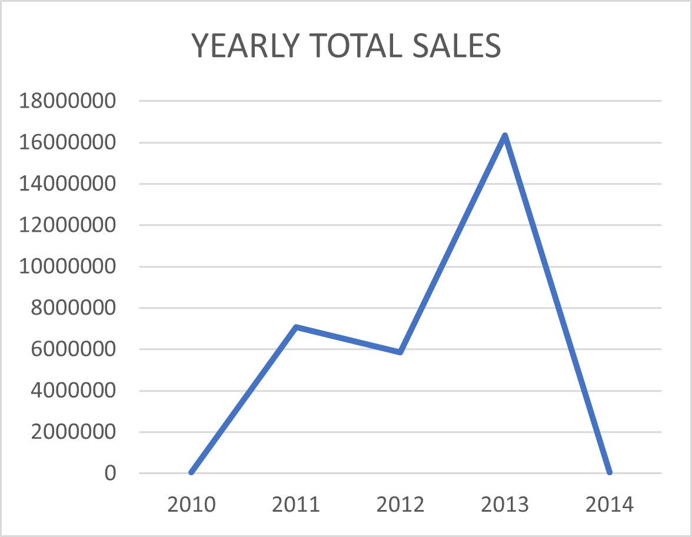

# 📊 SQL Data Analysis & Reporting Project

This project showcases the end-to-end SQL-based data analysis workflow on a simulated sales dataset. It includes data cleaning, trend analysis, performance evaluation, segmentation, and final report generation — modularized across separate SQL files.

---

## 📁 Project Structure

| File Name                  | Description                                                |
|----------------------------|------------------------------------------------------------|
| `00_compiled_scripts.sql` | Master script combining all analysis modules               |
| `01_time_analysis_trends.sql` | Yearly & monthly sales trend analysis                     |
| `02_cumulative_analysis.sql` | Running totals & moving average calculation               |
| `03_performance_analysis.sql` | Compare product performance vs target and YoY changes     |
| `04_data_segmentation.sql` | Grouping products based on price segments                 |
| `05_part_to_whole_analysis.sql` | Category-wise contribution to total sales              |
| `06_customer_report.sql`  | Customer segmentation (VIP, Regular, New)                  |
| `07_product_report.sql`   | Final cleaned product summary/reporting                    |
| `LICENSE`                 | Open-source license file (optional placeholder)            |
| `README.md`               | Project overview and documentation                         |

---

## 💡 Key Features

### 🔧 Data Cleaning
- Replaces blank/invalid values in date columns
- Null handling for price and sales-related calculations

### 📅 Time Trend Analysis
- Sales trends grouped by **month** and **year**
- Aggregates metrics: total sales, customers, quantity

### 📈 Cumulative Insights
- Computes **running totals** and **moving averages** using window functions

### 🎯 Performance Evaluation
- Tracks actual sales vs average and prior years
- Labels products as *Above Average*, *Below Average*, *No Change*, etc.

### 🧩 Product Segmentation
- Products grouped by pricing brackets: Below 100, 100–500, etc.

### 🧠 Customer Segmentation
- Groups customers as:
  - **VIP** – High spenders with long history
  - **Regular** – Medium spenders or stable users
  - **New** – Recent/low-value customers

### 📊 Part to Whole Analysis
- Calculates each category’s percentage share in overall revenue
---

## 🗂️ Database Schema (ER Diagram)

The SQL project uses a star schema centered around the `fact_sales` table, connected to `dim_customers` and `dim_products` via foreign keys.

This ER diagram illustrates the relationship between all core tables used in this project:

---

## 📊 Visual Insights

### 📅 Time Trend Analysis

#### 🗓️ Monthly Sales
Shows how total sales evolved month by month across the timeline.

#### 📈 Monthly Quantity Sold
Tracks the total quantity of products sold each month.

#### 👥 Monthly Customers
Number of distinct customers placing orders each month.

---

### 📆 Yearly Performance Summary

#### 💵 Total Sales per Year
Shows year-over-year growth or decline in overall revenue.

#### 📦 Yearly Quantity
Tracks units sold per year to identify volume trends.

#### 🧍‍♂️ Yearly Customers
Monitors how customer acquisition or retention changed over time.

---

### 🔁 Cumulative Insights & Moving Averages

#### 📊 Running Total Sales
Running sales helps visualize accumulation over time.

#### 📈 Cumulative Sales with Moving Average Price
Analyzes price trends with smoothing applied using a moving average.

#### 📈 Cumulative Total Sales
Overall growth in revenue with respect to time.

---

### 🎯 Performance Evaluation

Products categorized by whether they performed **Above** or **Below Average**, and **Increased** or **Decreased** compared to the previous year.

---

### 🧩 Product Segmentation

Grouping products by pricing tiers to identify premium vs budget segment distribution.

---

### 🧠 Customer Segmentation

Classifying customers as **VIP**, **Regular**, or **New** based on behavior and spending.

---

### 🍰 Part-to-Whole Analysis

Visualizing the **category-wise contribution** to total sales using a pie chart or bar chart.

---

## 🛠 Requirements

- **MySQL 8.0+** (for window functions like `ROW_NUMBER()` and `LAG`)
- A schema with the following tables:
  - `fact_sales`
  - `dim_products`
  - `dim_customers`

Optional CSVs or mock data should be placed in the `csv files/` directory.

---

## ▶️ How to Use

1. **Import the Database Schema & Data**.
2. Run the scripts in order or start with `00_compiled_scripts.sql` to execute everything at once.
3. View insights from each section independently using the modular `.sql` files.

---

## 👤 Author  
**Devansh Dhawan**  
*Bridging Data and Decisions — Turning Raw Data into Business & Financial Insights*

---

### 🔗 Connect with Me

Feel free to connect, collaborate, or explore more of my work:

- 💼 [LinkedIn – Devansh Dhawan](https://www.linkedin.com/in/devanshdhawan)
- 🗂️ [GitHub Profile](https://github.com/DevDhawan1)
- 📬 Email: [devanshdhawan8943@gmail.com](mailto:devanshdhawan8943@gmail.com)
- 🔖 [LinkedIn Project Post](https://www.linkedin.com/posts/devanshdhawan_project-sql-data)

---

## 📄 License

This project is licensed under the MIT License – see the `LICENSE` file for details.
